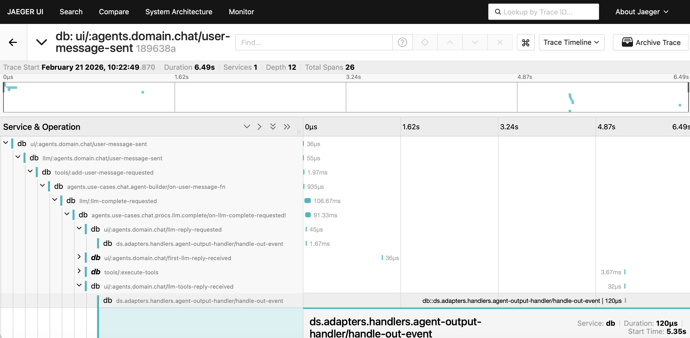

# AI TodoMVC Agent

An AI agent that helps you manage your todo list. Built on top of the popular [TodoMVC](http://todomvc.com/) app, you can manage todos the classic way (add, edit, toggle, delete in the UI) or via natural conversation—"Add buy milk and walk the dog," "Mark buy milk as done"—both on the same list.

<video src=".docs/media/todomvc_ai_agent_demo.mp4" controls width="100%"></video>

## 🎬 Demo

<p align="center">
  <a href="https://youtu.be/8aHSc9F6aws">
    
  </a>
</p>

---

## Prerequisites

- **JDK 21+** – the app uses virtual threads
- **OpenAI API key** – set the `OPENAI_API_KEY` environment variable

---

## Getting Started

### Start the server

```bash
bb dev
```

or:

```bash
clj -A:dev -X dev/-main
```

Then open [http://localhost:7777](http://localhost:7777).

### Run tests

```bash
bb test
```

### View traces (optional)

To inspect traces, run Jaeger in Docker first, then start the app. Traces are sent to Zipkin (`http://localhost:9411`) and viewable in the Jaeger UI at [http://localhost:16686](http://localhost:16686):

```bash
docker run --rm --name jaeger \
  -e COLLECTOR_ZIPKIN_HOST_PORT=:9411 \
  -p 6831:6831/udp -p 6832:6832/udp -p 5778:5778 \
  -p 16686:16686 -p 4317:4317 -p 4318:4318 -p 14250:14250 \
  -p 14268:14268 -p 14269:14269 -p 9411:9411 \
  jaegertracing/all-in-one:1.56
```

The Jaeger UI will be available at: [http://localhost:16686](http://localhost:16686)


